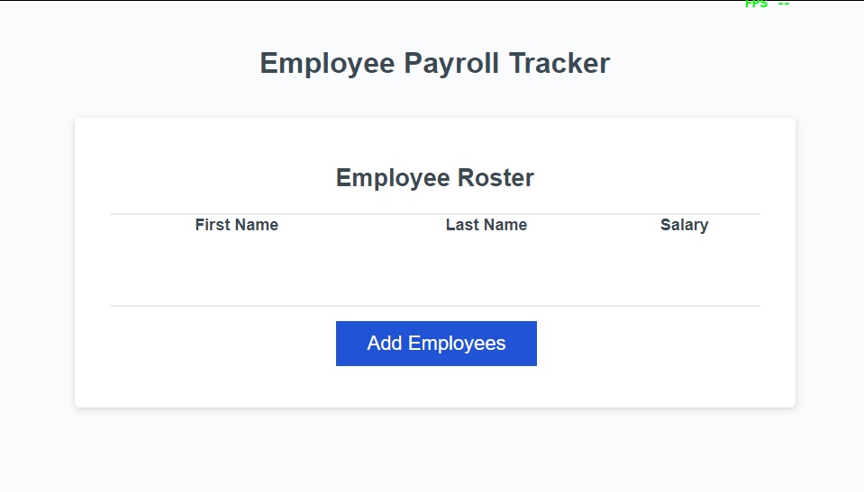

# Employee Payroll Tracker
This web application is designed to serve as an employee payroll tracker, catering specifically to the needs of payroll managers. It allows users to efficiently manage and monitor their employees' payroll data, facilitating proper budgeting for the company.

## Acceptance Criteria
Add Employee Functionality:

*When the "Add employee" button is clicked, the user is presented with a series of prompts asking for the employee's first name, last name, and salary.
Upon completing the addition of an employee, the user is prompted to either continue adding more employees or cancel the operation.
Data Display and Management:

* If the user chooses to cancel, the employee data is displayed on the page, sorted alphabetically by last name.
Additionally, the console should show computed and aggregated data, presumably related to the payroll information entered.

## Usage
1.    Clone the repository to your local machine.
2.    Open the index.html file in your preferred web browser.
3.    Click the "Add employee" button to start adding employee data.
4.    Follow the prompts to enter the employee's details.
5.    Choose to continue adding more employees or cancel the operation.
    *When canceled, view the sorted employee data on the page and check the console for computed and aggregated data.

## Technologies Used
* HTML
* CSS
* JavaScript
## Preview

## License
This project is licensed under the MIT License.   [please let me know the best place to find this information I just used one I saw on another persons README. file]

* Feel free to contribute to the project by forking it and submitting pull requests for any enhancements or fixes. If you encounter any issues or have suggestions for improvements, please open an issue. Thank you for using the Employee Payroll Tracker! 🚀
